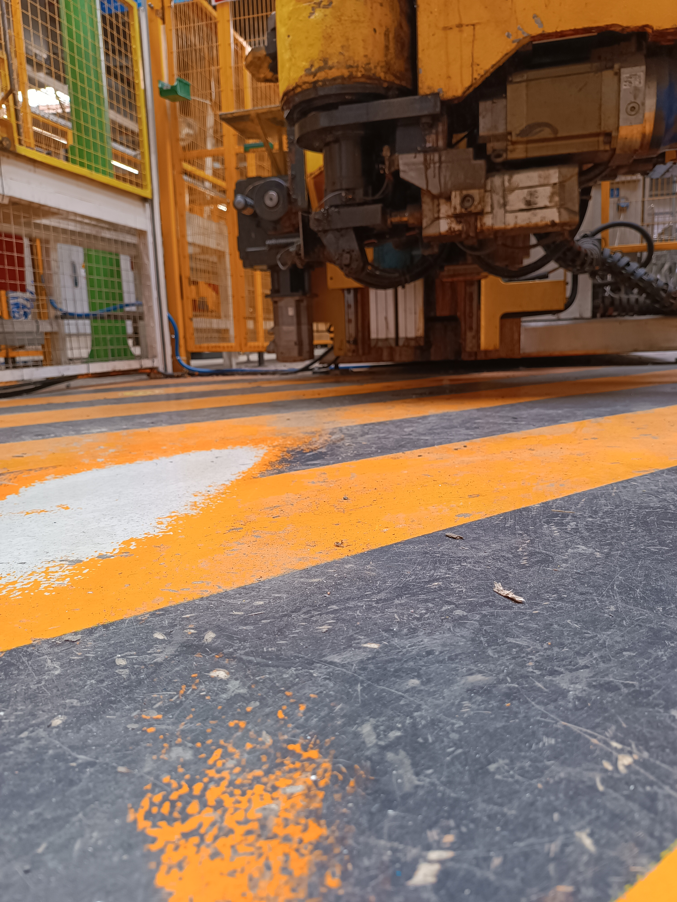
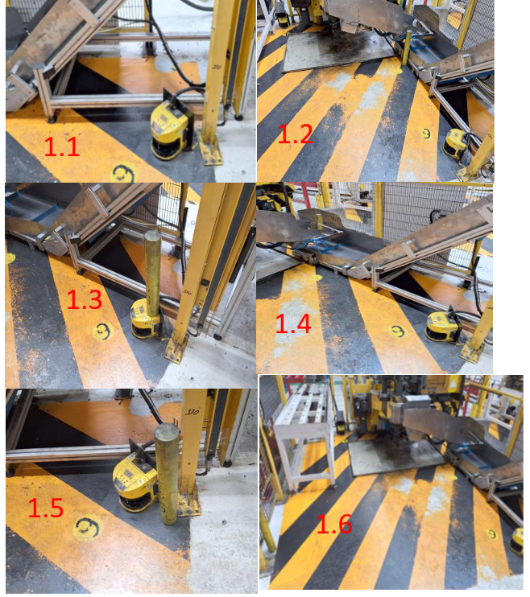

# Sick MLean od 25.05.2026 

## CM25
**Nelze** řešit, do pole zasahuje motor osy Z - za překážku radar nevidí.

Pan Hála nerozezná ohýbačky a má jeden obrázek z CM25 a druhý z CM24 - prošel jsem obě

[Google Photos](https://photos.app.goo.gl/R5oTXYeDyUMdwASp7)

[Google Photos](https://photos.app.goo.gl/LnJSWVDrDVdyy2LD6)

--------------------------------------------------
## CM24
**OK, hotovo**

--------------------------------------------------
## CM41
**Poznámky k fotografii**
- 1.1 - na fotografii jsem nenašel sloupek (problém)
- 1.2 - Sick scanner není žádný mikrometr - není rozumné tlačit pole takhle blízko pohyblivým částem, sebemenší otřes dopravníku zastaví ohýbačku v cyklu a budeme vyrábět scrap - **zkusím na zkušební tyč dodat botu a už to neprojde**
- 1.3 - scanner dostal stříšku - tento případ není ohrožení bezpečnosti, ale pokus o sabotáž výroby (nový scanner = 5000 euro)
- 1.4 - na fotografii jsem nenašel sloupek (problém)
- 1.5 - **toto bych mohl zkusit pořešit**
- 1.6 - zde stojí sloupek ve světelné závoře - nesmysl sem rozšiřovat pole, operátor se do 5cm nevejde!

