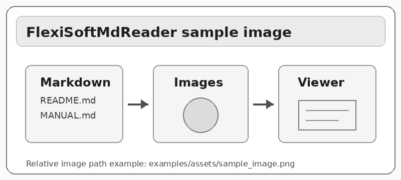

# Images Example

Example demonstrating image support in FlexiSoftMdReader.

## Image Syntax

Standard Markdown:

```markdown

```

## Sample Images




## Relative Paths

Image paths are relative to the Markdown file directory.

This file is in `examples/`, so images are loaded from `examples/assets/`.

## Supported Formats

- PNG (recommended)
- JPG/JPEG
- GIF
- BMP

## Alt Text

If an image cannot be loaded, the alt text is displayed instead.
